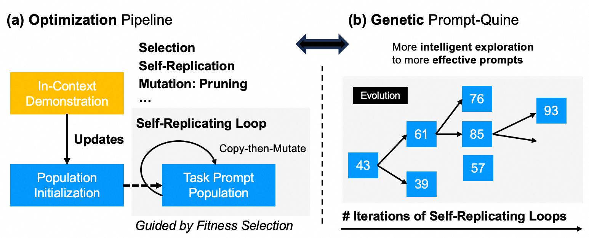

# PromptQuine 🦎

This repo contains the code of the discrete prompt optimization framework described in the paper \
**Evolving Prompts In-Context: An Open-ended, Self-replicating Perspective** \
ICML 2025

## Getting Started
> 🧬 A novel prompt design paradigm, resembling the open-ended nature of biological evolution 🦕.

* Conventional wisdom of LLM prompting suggests that well-cafted natural language instructions, combined with a few well-tuned demonstrations work best (e.g., see [this](https://proceedings.neurips.cc/paper_files/paper/2024/file/6b031defd145b02bed031093d8797bb3-Paper-Conference.pdf)) for current LLM prompting (often, have undergone significant alignment efforts).
* In our paper, we present a *counterintuitive result*: pruning random demonstrations into seemingly incoherent ''gibberish'' (both syntactically and semantically strange) can surprisingly improve task performance.
* Surprisingly, it often achieves near state-of-the-art prompt optimization results.
* This suggests that pruning original ICL prompts could be an elegant alternative towards prompt optimization or any other ICL stablization algorithms (e.g., via retrieving semantically similar examples).
* Nevertheless, **neither** traditional attribution methods **nor** prompt compression methods show effectiveness in our formulation.
* We thus propose an evolutionary search framework, namely **PromptQuine**, that automatically evolves decent pruning strategies over successive generations.
* Empirical success over multiple tasks and models has demonstrated the effectiveness of our framework.

## Author Message
We release **PromptQuine** as well as **TAPruning and SAHCPruning** for follow-up studies. We hope our work can serve as useful tools for further mechanistic studies of in-context learning and overall LLM prompt sensitivity.

## Setting Up
Note that although it's desirable to use vLLM v1 for the inference. By now, vLLM hasn't enabled the features of <logits-processor> in their up-to-date release. Thus, please install vllm~0.9x in order to support our classification task settings. 

Install our core modules with
> pip install -e .

## Usage
Please refer to the `examples` directory, which contains our implementations for  
1) few-shot classification (incl. multi-choice QA)
2) text style transfer,
3) reasoning,
4) jailbreaking.
as described in our paper.

The `PromptQuine` package provides the core components for prompt optimization.  
The task-specific code in `examples` implements the corresponding task modules and leverages these core modules to run experiments.

## Acknowledgment
We adapt the [RLPrompt codebase](https://github.com/mingkaid/rl-prompt/tree/main)
to provide a user-friendly implementation for classification
and text style transfer tasks.

