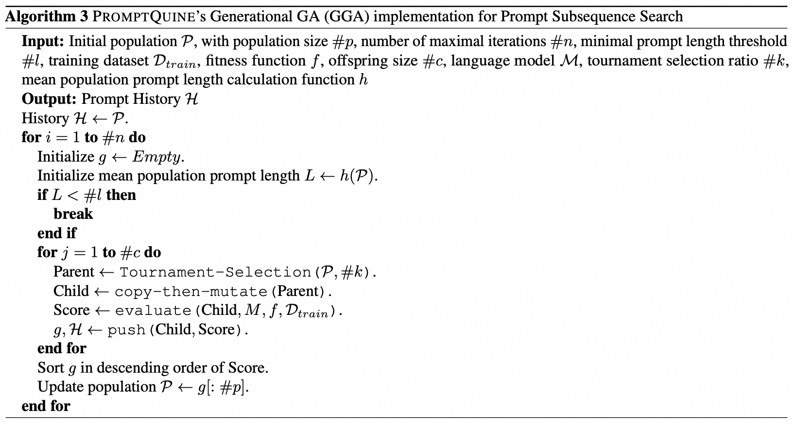
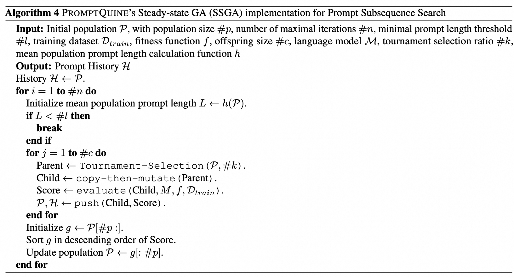

# Algorithm Modules for PromptQuine Paper
Here, we provide implementations for both **TAPruning** and **PromptQuine**, which can be easily adapted for your applications!

The pseudocode of our proposed algorithms is shown below:
## 1. TAPruning

Please refer to `TAPruner.py` for detailed implementation.

## 2. PromptQuine

Please refer to `PromptQuinePruner.py` for detailed implementation.